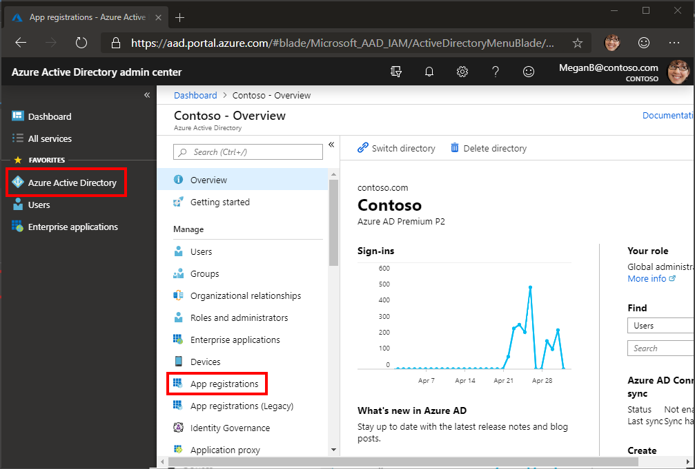

<!-- markdownlint-disable MD002 MD041 -->

В этом упражнении вы создадите новое собственное приложение Azure AD с помощью центра администрирования Azure Active Directory.In this exercise you will create a new Azure AD native application using the Azure Active Directory admin center.

1. Откройте браузер и перейдите в [Центр администрирования Azure Active Directory](https://aad.portal.azure.com) и войдите с помощью **личной учетной записи** (т.е. учетной записи Майкрософт) или **рабочей или учебной учетной записи**.Open a browser and navigate to the [Azure Active Directory admin center](https://aad.portal.azure.com) and login using a **personal account** (aka: Microsoft Account) or **Work or School Account**.

1. Выберите **Azure Active Directory** на панели навигации слева, затем выберите **Регистрация приложений** в разделе **Управление**.Select **Azure Active Directory** in the left-hand navigation, then select **App registrations** under **Manage**.

    

1. Выберите **Новая регистрация**.Select **New registration**. На странице**Зарегистрировать приложение** задайте необходимые значения следующим образом.On the **Register an application** page, set the values as follows.

    - Введите **имя** `iOS Swift Graph Tutorial`.Set **Name** to `iOS Swift Graph Tutorial`.
    - Введите **поддерживаемые типы учетных записей** для **учетных записей в любом каталоге организаций и личных учетных записей Microsoft**.Set **Supported account types** to **Accounts in any organizational directory and personal Microsoft accounts**.
    - Оставьте поле **URI перенаправления** пустым.Leave **Redirect URI** empty.

    

1. Выберите **регистр**.Select **Register**. На странице **учебника SWIFT Graph для iOS** СКОПИРУЙТЕ значение **идентификатора Application (Client)** и сохраните его, он понадобится на следующем шаге.On the **iOS Swift Graph Tutorial** page, copy the value of the **Application (client) ID** and save it, you will need it in the next step.

    

1. Выберите **Проверка подлинности** в разделе **Управление**.Select **Authentication** under **Manage**. Выберите **Добавить платформу**, а затем **iOS/macOS**.Select **Add a platform**, then **iOS / macOS**.

1. Введите идентификатор пакета приложения и выберите configure ( **настроить**), а затем нажмите кнопку **Готово**.Enter your app's Bundle ID and select **Configure**, then select **Done**.
